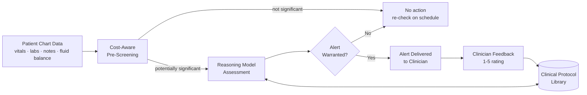
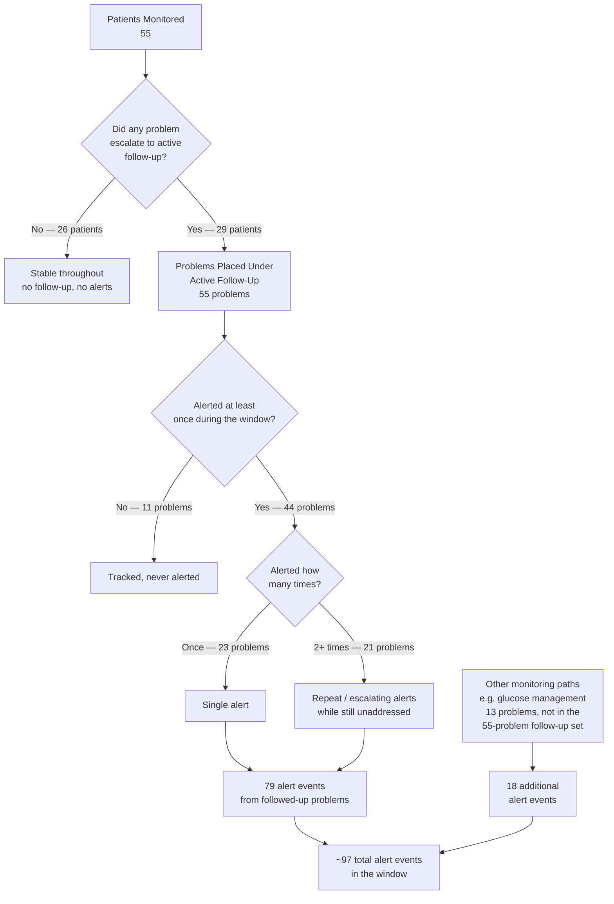

# Reasoning-Model Monitoring with Customizable Clinical Protocols: An Explainable, Cost-Effective Approach to Continuous Patient Surveillance

*Draft for academic circulation. Architecture described at concept level only; implementation details withheld pending patent filing.*

## Abstract

Continuous monitoring of hospitalized patients produces more vitals, labs, and notes than clinicians can realistically re-review every hour. Rule-based early warning systems ease this burden but are rigid, generate frequent false alarms, and cannot encode the context-dependent judgment clinicians actually use. We describe a monitoring architecture that instead uses a reasoning-capable large language model (LLM) to continuously re-assess each patient's active clinical problems, guided by a library of clinician-authored, editable protocols that suppress alerts in expected contexts, inject domain-specific reasoning, and require documentation audits — without retraining the model or changing code. We report early findings from an ongoing pilot deployment: the system screens admitted patients and routes alerts to clinicians via chat, with optional 1–5 star feedback on every alert. Over a 24-hour observation window, it monitored 55 patients, generated 77 model-reasoned alerts and 19 protocol-triggered "care-gap" alerts, and silently resolved 36.7% of tracked problems without ever alerting. Cost analysis shows $0.033 per full reasoning-model evaluation versus $0.0009 for a lightweight pre-screening pass, with per-patient-per-day cost trending downward. This combination — LLM reasoning for adaptability, an editable protocol layer for explainability and governability, and clinician feedback for continuous quality measurement — addresses two persistent barriers to AI adoption in clinical decision support (alert fatigue and distrust of opaque models) while remaining economically viable at scale.

---

## 1. Introduction

Clinical staff cannot be at every bedside continuously, so hospitals rely on threshold-based early warning scores such as NEWS2 to flag deterioration. These are screening tools, not diagnostic tests, and generate substantial false positives because generic thresholds ignore individual variation such as chronic hypoxia or post-operative physiology [7,8]. The result is well-documented alert fatigue, where excessive low-relevance alerts desensitize clinicians to genuinely important warnings [1,2].

Large language models offer an alternative: reasoning over unstructured notes and multiple data types rather than fixed thresholds, with emerging evidence of improved performance on tasks such as medication-error detection [3,4]. But the literature consistently identifies trust, not accuracy, as the main barrier to adoption — clinicians adopt tools they understand, and model opacity remains a persistent obstacle in high-stakes settings [5,6].

This creates a tension: rule-based systems are explainable but rigid and fatigue-inducing; LLM-based systems are adaptive but typically opaque and hard to govern locally. This paper describes an architecture at that intersection. A reasoning-capable LLM continuously re-assesses each patient's clinical problems, constrained and explained by an editable library of clinician-authored protocols that suppress alerts in expected contexts, inject reasoning guidance, and require documentation audits — without retraining the model or changing code. A structured clinician feedback loop closes the loop on alert quality, consistent with human-in-the-loop practice in clinical AI [9]. Because LLM inference carries a real per-call cost, cost-effectiveness is a first-class design requirement; API-based access to capable models, combined with usage patterns that minimize unnecessary calls, is generally the most practical route for resource-constrained healthcare settings [10].

The remainder of this paper describes the system's design (Section 3), study methods (Section 4), outcome and cost results (Sections 5–6), and implications and limitations (Sections 7–8).

---

## 2. Background

**Alert fatigue and the limits of threshold-based monitoring.** Early warning scores convert a few physiological parameters into a composite score and fire an alert when it crosses a fixed threshold — simple and auditable, but scored against the same generic baseline regardless of context. A patient recovering from thoracic surgery, one with chronic compensated respiratory failure, and one with a first episode of sepsis are all judged against identical cutoffs, even though "abnormal for this patient" means something different in each case. The result is a high rate of clinically low-value alerts, which drives the alert fatigue that undermines the very systems meant to prevent missed deterioration [1].

**Why reasoning models differ from rule engines or classifiers.** A rule engine or classifier decides based on a fixed function of a fixed input schema. A reasoning-capable LLM instead ingests heterogeneous, largely unstructured information — vitals, lab trends, free-text notes — and produces a structured judgment with the reasoning behind it. In principle this lets the system recognize that "patient tolerating oral diet, NPO order discontinued" is clinical progress rather than a contradiction of an earlier note — a distinction a rule-based system would struggle to make without extensive custom logic for every such scenario.

**Why explainability and governability still matter with a reasoning model.** The flexibility that makes LLM reasoning attractive also makes it risky without additional structure: a model's internal reasoning can be hard to predict, audit, or correct after the fact. The explainable-AI literature is consistent — the central barrier to adoption is not model accuracy but whether clinicians and institutions can understand, audit, and override its behavior [6]. A system correctable only by retraining or by an engineer editing source code does not meet that bar in a setting where local practice and patient-specific context change constantly.

---

## 3. System Overview

At a conceptual level, the architecture consists of five cooperating components (Figure 1).

1. **Continuous chart monitoring.** The system re-evaluates every admitted patient on a fixed schedule (hourly in this deployment), checking for any new vital, lab, note, or fluid-balance change since the last evaluation.

2. **Cost-aware pre-screening.** Not every chart update warrants a full reasoning-model call. A lightweight screening step first checks whether new information is potentially significant; data that is clearly normal or unchanged is filtered out here. This is a general cost-control principle; the specific screening logic is withheld as part of the underlying implementation.

3. **Reasoning-model assessment.** When new information is potentially significant, a reasoning-capable LLM evaluates the patient's current clinical problems against all available information — vitals, labs, notes, clinical history — and determines, per problem, whether it is stable, improving, worsening, or needs attention. "Problem" here means a single distinct clinical issue tracked for a patient (e.g. hyperglycemia, hypoxemia, an acute kidney injury); a patient may have several, each assessed independently (Section 3.3).

4. **The clinical protocol library.** The model is guided by a library of clinical protocols, authored and maintained independently of the model and code. Each protocol can carry any combination of three capabilities (Figure 2):
   - **Context suppression** — defines clinical scenarios where an otherwise-abnormal finding is expected and should not alert (e.g. a permissive BP range for a documented, actively managed hypertension plan).
   - **Reasoning guidance** — verbatim clinical logic the model must apply for a matching problem (e.g. requiring a sustained decline before flagging a single reading).
   - **Documentation audit** — a requirement that specific documentation exist within a set window after a problem is first detected, checked independently on schedule.

   Because protocols are editable structured records, not code, clinical stakeholders can add, refine, or retire one without touching the model — the core explainability/governability mechanism: every alert or suppression traces back to either the model's own reasoning or a specific, human-readable protocol.

5. **Clinician feedback loop.** Every alert is delivered via chat and can be rated 1–5 with optional comment. Ratings, together with the protocol (if any) involved in each decision, drive the quality measurement in Section 5 and inform ongoing protocol refinement.


*Figure 1. Conceptual architecture. New chart data first passes through an inexpensive screening step; only potentially significant changes reach the reasoning model, which evaluates them in the context of an editable clinical protocol library. Clinician feedback closes the loop, informing future protocol refinement.*

```mermaid
flowchart TB
    R[Reasoning Model\nAssessing a Clinical Problem]
    S[Context Suppression\n\"Is this an expected,\nalready-managed situation?\"]
    G[Reasoning Guidance\n\"What specific clinical logic\napplies to this problem type?\"]
    D[Documentation Audit\n\"Was the required follow-up\ndocumentation recorded in time?\"]
    S --> R
    G --> R
    D -.-> R
```
*Figure 2. The three capabilities a clinical protocol may carry. A single protocol can combine any subset of these; all three are authored and maintained as editable clinical content, independent of the reasoning model.*

### 3.1 Alert Structure and Auditability

Explainability operates at two layers: one for the clinician receiving an alert, one for anyone later auditing the system.

Each alert card presents a structured summary, not raw model output: the specific problem, the objective finding observed and when, a plain-language statement of *why* it's alerting, and relevant caveats (e.g. a stale-vitals warning if the last verified reading is hours old). A collapsed "model reasoning" section lets the clinician expand into the full chain of reasoning if wanted.

Beyond alerts that were sent, every underlying decision — what evidence was considered, what it showed, how it led to the conclusion — is retained and independently traceable. Problems under active tracking that haven't yet crossed the alert threshold are visible in an ongoing "next-check" queue: what parameter is being watched, which protocol (if any) governs it, when the next re-assessment is due, and whether it's on schedule. This lets governance staff, not just engineers, reconstruct what the system observed and how it reasoned at any point — not only at the moment of an alert.

### 3.2 Alert Generation Pathways

Not every alert is produced the same way; the outcome data in Section 5 combines counts from all of the following.

- **Reasoning-model pathway.** The default, most common route: the model evaluates a tracked problem against the full context and independently concludes an alert is warranted. Labeled "LLM Alerts" throughout.
- **Protocol-triggered ("care-gap") pathway.** A small number of alerts fire directly off a matching protocol — e.g. a pre-defined dangerous condition present without an adequate documented plan. Labeled "care-gap alerts," intentionally a much smaller share of total volume, consistent with protocols acting as a targeted safety layer rather than the primary detector.
- **Fast-cycling condition-specific pathways.** Certain high-frequency situations — glucose management is the clearest example — run on their own faster cadence, separate from the general problem-tracking cycle. As a result, alerts from this pathway don't always appear in the "active follow-up" tracking used to count most monitored problems (Section 5.1).

All pathways converge on the same alert card, reasoning summary, and audit trail (Section 3.1) — the distinction matters for interpreting outcome data, not for what the clinician sees.

### 3.3 Per-Problem Tracking

The unit the system reasons about — and reports throughout Section 5 — is the individual clinical **problem**, not the patient as a whole. The system maintains a running, per-patient list of distinct problems (e.g. a post-op patient might have separate, independently tracked problems for pain, a mild AKI, and stress hyperglycemia). Each carries its own status (stable/improving/worsening/critical/resolved) and its own history of assessments, alerts, and protocol involvement.

This matters for two reasons. First, a patient with three active problems contributes three entries to problem-level tallies despite counting once as a patient — the reported "problems" are not a proxy for patient count. Second, only a problem assessed as worsening or critical is placed under active, scheduled follow-up with its own path to resolution or alert; a problem judged stable throughout is tracked but never enters that state, and contributes no follow-up or resolution events — it is simply monitored quietly.

---

## 4. Methods

### 4.1 Study Design

This is a **prospective observational pilot study** of an LLM-based monitoring architecture deployed as a live clinical support tool. No intervention was made beyond delivering advisory alerts; the system ran alongside, not in place of, standard monitoring and rounding. No patients, treatments, or staffing were altered for this study — the analysis is descriptive, characterizing real-world behavior rather than a controlled comparison against a baseline. It reports observed performance and cost, not a causal estimate of clinical benefit; a comparative or randomized design assessing downstream outcomes (e.g. time-to-intervention, adverse event rates) is a natural next phase, discussed in Section 8.

### 4.2 Setting and Population

The system operated over admitted patients across several clinical workspaces at the treating institution, spanning intensive and step-down monitoring. The population was not filtered — every patient admitted to a monitored workspace during the period was included. Results in Section 5 are drawn from a single 24-hour observation window (2026-07-02 to 2026-07-03), discussed further as a limitation in Section 8.

### 4.3 Procedure

The system ran hourly, re-evaluating each patient's chart for new vitals, labs, notes, and fluid balance since the last cycle, per the architecture in Section 3. When a clinician needed to be notified, it delivered a structured alert card via the clinical team's existing group chat, describing the problem, the triggering finding, and the model's reasoning (Section 3.1). Clinicians could optionally rate each alert 1–5 with free-text feedback; a rating was not required for alert delivery. Problems never alerted on — resolved on their own, or suppressed by a protocol — were also tracked, so "silent resolution" could be measured directly rather than inferred.

### 4.4 Outcome Measures

The following, captured automatically with no manual chart abstraction, are reported in Section 5:

- **Monitoring volume** — number of distinct patients monitored, and number of distinct clinical problems placed under active, scheduled follow-up (defined as a problem assessed as worsening or critical at least once during the window).
- **Resolution outcome** — for each followed-up problem, whether it resolved (returned to a stable/improving/resolved state) by the end of the observation window, and whether it did so with or without ever generating an alert.
- **Alert volume and source** — total count of alert events, broken out by which of the pathways described in Section 3.2 produced each alert, and by which clinical protocol (if any) was involved in the decision.
- **Cost** — per-run computational cost, separated by whether the run required a full reasoning-model evaluation or only the lightweight pre-screening pass, and an estimated cost per patient per day.

### 4.5 Data Source and Analysis

All figures in Sections 5–6 were extracted directly from the system's operational logging store for the stated window, using the same query logic as the live dashboard — no manual re-aggregation, sampling, or exclusion beyond the date-range filter. Analysis is descriptive: counts and percentages, with no inferential testing, consistent with the single-window, pilot-stage nature of this report.

---

## 5. Results

Outcome data below is from a 24-hour observation window (2026-07-02 to 2026-07-03), drawn from the system's live operational dashboard.

### 5.1 Overall monitoring volume and alert yield

"Actively monitored" here means problems flagged as worsening or critical and placed under scheduled follow-up — the subset the system judged to need continued attention, as opposed to problems assessed as stable or improving throughout.

| Metric | Value |
|---|---|
| Patients monitored | 55 |
| Problems placed under active follow-up | 55* |
| Problems resolved by end of window | 30 (54.5% of those followed up) |
| — resolved without any alert | 11 (36.7% of resolved problems) |
| Problems still under active follow-up at window end | 25 |
| Model-reasoned alerts ("LLM Alerts") | 77† |
| Protocol-triggered "care-gap" alerts | 19† |

\* *Coincides numerically with "patients monitored" but is a different population: only 29 of the 55 monitored patients ever had a problem escalate to active follow-up (the other 26 stayed stable and contributed none); those 29 account for all 55 followed-up problems, most contributing one or two each.*

† *These are alert events, not distinct problems, and should not be expected to sum to 55. A followed-up problem can alert more than once if it stays unresolved across re-checks — most that alerted did so once, a smaller number repeatedly. A minority of alerts also come from separately-cadenced pathways (glucose management is the clearest example) not represented in the 55-problem count at all (Section 3.2).*

Figure 3 traces this funnel from monitored patients down to individual alert events, showing where "problem count" and "alert count" part ways.


*Figure 3. Funnel from monitored patients to individual alert events, 2026-07-02 to 2026-07-03. "Problem count" (55) and "alert count" (77 LLM-reasoned + 19 care-gap ≈ 96, or 97 by exact event tally) diverge because a single problem can alert repeatedly, and because some alerts come from pathways — like the fast-cycling glucose-management pathway (Section 3.2) — outside the active-follow-up tracking shown here. The ≈97 vs. 96 gap is ordinary snapshot-timing drift between the two data pulls, not a counting discrepancy.*

Two observations stand out. First, of the followed-up problems that reached resolution, more than a third resolved **without ever generating an alert** — a measurable counterweight to the alert-fatigue risk in Section 2: indiscriminate alerting would push this rate toward zero. Second, most alerts in this window (77 of 96, 80%) came from the reasoning model's own judgment rather than a fixed protocol rule — free-form reasoning, not rigid thresholds, is doing most of the detection work, with protocols as a smaller, targeted layer on top.

### 5.2 Alert and monitoring activity by protocol

The system logs, for every alert and every actively followed-up problem, which protocol (if any) was involved. "None (model reasoning)" means the decision was driven entirely by the model, with no protocol match. A problem or alert can be associated with more than one protocol at once (e.g. covered by both a vital-ceiling rule and a respiratory-guidance rule), so the columns below sum to more than the Section 5.1 totals — protocol co-occurrence, not double-counting. Plain-language protocol descriptions are in Appendix B.

| Protocol | Problems Under Active Follow-Up | Model-Reasoned Alerts |
|---|---|---|
| None (model reasoning) | 25 | 36 |
| Emergency vital-sign ceiling override | 21 | 27 |
| Respiratory trend reasoning (SpO2/FiO2) | 13 | 17 |
| Expected respiratory context (post-op / chronic baseline) | 12 | 16 |
| Expected hypertension context (neuro/vascular) | 5 | 4 |
| Tachycardia assessment protocol | 4 | 6 |
| Renal and fluid-balance reasoning | 2 | 2 |
| Lactate and perfusion alert criteria | 2 | 2 |
| Acknowledged cardiac injury context | 1 | 0 |
| Neurological (GCS) trend reasoning | 1 | 0 |
| Haemoglobin drop alert criteria | 1 | 0 |
| Established baseline low consciousness | 0 | 0 |

"None (model reasoning)" is the single largest category (25 of 55, ~45%), confirming the model's own judgment — not a fixed protocol — does most of the day-to-day surveillance, with protocols layered on top. Within that layer, two roles are visible. Protocols that **force attention despite mitigating context** — the vital-sign ceiling override and lactate/perfusion criteria — show substantial alert volume relative to problem count, consistent with ensuring a genuinely dangerous reading is never tolerated. Protocols that **suppress alerting in an already-understood state** — neurological trend reasoning, haemoglobin drop criteria, established low-consciousness context — generated zero alerts despite active tracking, and one (established low consciousness) had no problems escalate at all.

#### What "none (model reasoning)" is actually made of

The "none" row is the largest single category, so it's worth showing what it contains. Grouping its 25 problems by clinical area:

| Clinical area | Problems in this window | Examples |
|---|---|---|
| Metabolic / endocrine | 8 | Hyperglycemia (×5), diabetic ketoacidosis, metabolic acidosis, hypoalbuminemia |
| Respiratory | 7 | Type 2 respiratory failure, respiratory distress, respiratory depression, severe respiratory acidosis, hypoxemic respiratory failure, bilateral lung consolidations |
| Infectious / haematologic | 5 | Sepsis, cellulitis, diabetic foot infection, leukocytosis, severe anaemia |
| Mixed circulatory | 3 | Tachycardia (×2), hypotension |
| Gastrointestinal / hepatobiliary | 2 | Acute gastrointestinal bleed, acute pancreatitis with cholelithiasis |

No single clinical area dominates — metabolic, respiratory, infectious, mixed circulatory, and gastrointestinal problems appear in roughly similar proportions, consistent with the model acting as a general-purpose assessor rather than being effective only in a narrow domain. Two of the problems here (tachycardia cases) fall outside the dedicated tachycardia protocol despite superficially matching it — a reminder that protocol coverage isn't exhaustive, and the model is relied on to catch what protocol matching misses.

### 5.3 Interpretation

These results show the intended division of labor: the reasoning model independently follows the largest share of problems across a broad range of clinical areas, and the protocol layer makes small, targeted, human-auditable adjustments on top — pushing alerting up where under-alerting would be dangerous (vital-sign ceiling override, lactate/perfusion criteria), or pulling it toward zero where the model's default would otherwise be too sensitive to an expected or managed state (established hypertension in a neuro/vascular context, a resolving neurological baseline). Because each adjustment maps to a specific, named, editable protocol rather than a change to model weights or code, a governance team can review exactly which situations the system treats differently from its default judgment — and revise that without engineering involvement.

---

## 6. Cost-Effectiveness

A central design goal is that continuous, hourly, multi-patient LLM monitoring must be affordable at scale, not merely accurate. The system achieves this mainly through the cost-aware pre-screening in Section 3, which reserves the expensive reasoning call for potentially significant updates and routes everything else through a cheaper path.

Over the observation window:

| Run type | Cost per run | Volume |
|---|---|---|
| Expensive (full reasoning-model) run | $0.0331 | 186 runs |
| Cheap (lightweight pre-screening only) run | $0.0009 | 62 runs |

The cost differential is roughly 37-fold between a full reasoning evaluation and a lightweight screening pass. Because most hourly re-checks do not surface new clinically significant information, this tiered design keeps the *average* cost per patient well below what a "full reasoning call every hour for every patient" design would require. Estimated cost per patient per day declined slightly over the observation window (from ~$0.070 to ~$0.061), consistent with the literature finding that API-based access to capable LLMs, combined with usage patterns that minimize unnecessary calls, is a practical route to deploying LLM-based clinical tools without the fixed cost of self-hosting [10].

At current rates, continuous hourly monitoring of a single patient costs a few cents a day — orders of magnitude below equivalent clinical staff time, and low enough that cost is unlikely to limit scaling, provided the tiered design is preserved as volume grows.

---

## 7. Discussion

The results support this paper's central thesis: a reasoning-model monitoring system, paired with an editable protocol layer, can combine the adaptability of LLM reasoning with the explainability and governability clinical stakeholders require, while staying cost-effective at scale.

Three points stand out for a clinical audience considering similar systems.

**Explainability is structural, not incidental.** Because every alert (or suppression) traces to either the model's own stated reasoning or to a specific, named, human-readable protocol, a clinician or governance committee is never confronted with an unexplainable "black box" decision. As described in Section 3.1, this holds at two levels: the clinician sees a plain-language summary with the option to expand into full reasoning, and separately, the complete evidence and reasoning trail behind every decision — including decisions not to alert — is retained for later audit. This directly addresses the barrier to adoption most consistently identified in the explainable-AI literature: not raw accuracy, but the ability to understand and correct the system's behavior [5].

**The protocol layer is a governance mechanism, not just a tuning knob.** Unlike a rule-based system, where every behavior change needs a new hard-coded rule, or a purely model-based system, where change needs retraining or prompt engineering, this architecture lets clinical domain experts directly author, review, and revise the conditions under which the system will or will not alert — shortening the loop from "the system is behaving wrong" to "it's fixed," with no engineering cycle required.

**Measured, not assumed, alert quality.** The resolved-without-alert rate (Section 5.1) and the per-protocol breakdown (Section 5.2), together with clinician star ratings on every alert, give this architecture a continuously updated, quantitative signal of whether its alerting behavior is actually useful — granular enough to identify which protocols or reasoning patterns need revision. This operationalizes the human-in-the-loop principle that clinician feedback should function as structured learning input keeping the system aligned with clinical need over time [9].

More broadly, this architecture is not specific to one clinical setting. The pattern — continuous reasoning-model surveillance, an editable protocol layer for governance, and a clinician feedback loop — generalizes to any setting where staff must monitor many patients against an evolving body of contextual judgment: general wards, post-anesthesia recovery, tele-ICU monitoring, and chronic disease management outside the hospital are all plausible extensions.

---

## 8. Limitations

This is an early-stage report from a single deployment. Figures in Sections 5–6 are from a 24-hour window and should be read as an illustrative snapshot, not a definitive efficacy or cost claim; alert-source and protocol-identity tracking were only recently instrumented, so historical comparisons aren't available. A longer period, spanning multiple weeks and populations, would be needed for stable estimates of alert precision, resolved-without-alert rate, and cost per patient per day, and to check sensitivity to case mix or seasonal variation.

Clinician star ratings are an imperfect ground truth — a momentary judgment, not a formally adjudicated outcome, and inter-rater variation hasn't been quantified here. The "care-gap" category depends on the protocol library's correctness; a miscalibrated protocol would still produce plausible-looking statistics without reflecting real safety improvement. Because the architecture is described only conceptually pending patent filing, this paper omits the implementation detail (specific thresholds, screening criteria, prompting strategy) needed for independent replication; a fuller technical disclosure is expected once IP protections are in place.

This study is observational and descriptive — it reports what the system did, not what would have happened without it, and cannot alone support a claim of improved clinical outcomes (earlier intervention, fewer adverse events, reduced workload) versus standard practice. That would need a comparative design — a randomized or stepped-wedge deployment, or a longer before/after comparison — with prespecified clinical endpoints rather than the system-internal metrics reported here. We view this study as characterizing the system's behavior closely enough to justify that next phase, not as a substitute for it.

---

## 9. Conclusion

Continuous, LLM-based monitoring is technically feasible today, but its clinical value depends on more than model accuracy — on whether clinicians can trust, understand, and locally govern the system, and whether it's affordable to run continuously across a whole patient population. We described an architecture pairing a reasoning-capable LLM with an editable protocol library and a clinician feedback loop, and reported early pilot evidence that the system alerts selectively (a 36.7% resolved-without-alert rate), that its protocol layer produces interpretable, targeted adjustments, and that its tiered cost design keeps monitoring affordable at a few cents per patient per day. Reasoning for adaptability, protocols for explainability and governability, feedback for measured quality — this combination offers a practical path to clinical AI monitoring tools that clinical teams can actually trust and maintain themselves.

---

## References

1. Ray Wilson, R. et al. (2026). Alert fatigue measurement in clinical decision support: a systematic review. *Journal of the American Medical Informatics Association*. https://academic.oup.com/jamia/advance-article/doi/10.1093/jamia/ocag064/8684938
2. Computational approaches to alleviate alarm fatigue in intensive care medicine: A systematic literature review. (2022). *Frontiers in Digital Health*. https://www.frontiersin.org/journals/digital-health/articles/10.3389/fdgth.2022.843747/full
3. A Review of Large Language Models in Medical Education, Clinical Decision Support, and Healthcare Administration. (2025). *Healthcare* (MDPI), 13(6), 603. https://www.mdpi.com/2227-9032/13/6/603
4. Large language model as clinical decision support system augments medication safety in 16 clinical specialties. (2025). *Cell Reports Medicine*. https://www.cell.com/cell-reports-medicine/fulltext/S2666-3791(25)00396-9
5. Explainable AI for Clinical Decision Support Systems: Literature Review, Key Gaps, and Research Synthesis. (2025). *Informatics* (MDPI), 12(4), 119. https://www.mdpi.com/2227-9709/12/4/119
6. Explainability in medicine in an era of AI-based clinical decision support systems. (2022). *PMC*. https://www.ncbi.nlm.nih.gov/pmc/articles/PMC9527344/
7. Modifications to the National Early Warning Score 2: a Scoping Review. (2025). *BMC Medicine*. https://link.springer.com/article/10.1186/s12916-025-03943-0
8. Predictive performance and temporal dynamics of national early warning score 2 (NEWS2) in detecting clinical deterioration in general ward. (2025). *ScienceDirect*. https://www.sciencedirect.com/science/article/pii/S2666520425002577
9. Human in the loop artificial intelligence in healthcare: applications, outcomes, and implementation challenges. (2026). *ScienceDirect*. https://www.sciencedirect.com/science/article/pii/S1386505626001024
10. A strategy for cost-effective large language model use at health system-scale. (2024). *PMC*. https://pmc.ncbi.nlm.nih.gov/articles/PMC11574261/

---

## Appendix A: Data Sources

All outcome and cost figures reported in Sections 5 and 6 are drawn directly from the system's live operational monitoring dashboard ("Alert Quality & Cost" view), covering the observation window 2026-07-02 to 2026-07-03. Figures are reported as displayed on the dashboard without independent re-aggregation.

## Appendix B: Protocol Descriptions

Plain-language descriptions of each clinical protocol referenced in Section 5.2, in the same order as the results table. Descriptions are conceptual and intentionally omit exact numeric thresholds, matching logic, and prompt content, consistent with the patent-safety scope of this paper (see Section 8).

| Protocol (as named in this paper) | What it does |
|---|---|
| Emergency vital-sign ceiling override | Forces clinician attention when a vital sign (blood pressure, heart rate, or oxygen saturation) reaches an emergency-level reading, even if a management plan is already documented — a plan that leaves a patient in that range is treated as not yet adequately controlling the problem. |
| Respiratory trend reasoning (SpO2/FiO2) | Guides the model to judge oxygenation using the relationship between oxygen saturation and the level of supplemental oxygen support over time, rather than a single reading in isolation, so that a planned reduction in oxygen support is not mistaken for deterioration. |
| Expected respiratory context (post-op / chronic baseline) | Defines specific clinical situations — such as the immediate post-operative period, or a patient with a known chronic respiratory baseline — in which a degree of respiratory abnormality is expected and should not, by itself, trigger an alert. |
| Expected hypertension context (neuro/vascular) | Defines specific neurological and vascular situations (for example, particular stroke or raised-intracranial-pressure scenarios) in which a higher-than-normal blood pressure is the clinically intended target, so it is not alerted on as uncontrolled hypertension. |
| Tachycardia assessment protocol | Provides a structured reasoning sequence for an elevated heart rate, distinguishing an unstable presentation that warrants an immediate alert from a stable, explained, and already-managed elevation. |
| Renal and fluid-balance reasoning | Guides the model on how to correctly interpret incomplete or batch-charted fluid intake/output data before concluding that a patient's kidney function or fluid balance is deteriorating. |
| Lactate and perfusion alert criteria | Defines the clinical circumstances under which an elevated lactate level should trigger an alert, based on whether it is accompanied by other signs of poor perfusion. |
| Acknowledged cardiac injury context | Suppresses further alerting on a marker of cardiac injury once the treating team has already reviewed and acknowledged the finding within a defined recent time window. |
| Neurological (GCS) trend reasoning | Requires a clinically meaningful drop in level of consciousness over a defined recent time window before alerting, rather than alerting on a chronically low but stable level of consciousness. |
| Haemoglobin drop alert criteria | Defines the specific fall in haemoglobin, or floor value, that should trigger an alert, as distinct from a stable, chronically low haemoglobin level. |
| Established baseline low consciousness | Suppresses alerting on a patient's already-known, chronic baseline level of consciousness, so the system does not repeatedly flag an unchanged, expected finding. |
