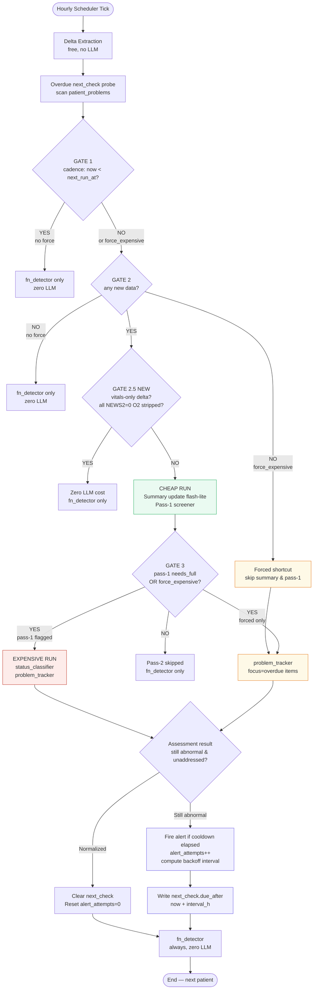

# CDS Pipeline — Per-Patient Decision Flow

This page documents the adaptive scheduling logic introduced to reduce LLM cost and guarantee
per-problem clinical follow-up. The pipeline runs **every hour** (Cloud Scheduler), loops all
admitted patients sequentially, and applies a cascade of gates before reaching any paid LLM call.

---

## Gate sequence



---

## The three new gates

### GATE 2.5 — Vital-within-normal gate

Added in `fn_detector.py` (`is_vital_row_normal`, `all_new_vitals_normal`).

Fires when:
- The delta is **vitals-only** (no new labs, notes, or report findings)
- Every new vital row scores **0 on NEWS2** — with the FiO2/supplemental-O2 component stripped so stable ventilated patients can also be skipped
- No Netra camera `abnormal_list` flags
- GCS ≥ 15

Result: zero LLM spend for that cycle. The fn_detector safety net still runs.

### Overdue next_check forced pass-2

When `overdue_next_checks()` finds any problem whose `next_check.due_after < now`, the pipeline
sets `force_expensive=True`. This flag bypasses the cadence gate, delta gate, and pass-1 gate so
the expensive run fires regardless. The `focus` list is injected into `track_problems` as a
`FORCED FOLLOW-UP` block naming the overdue parameter(s), directing the model's attention.

### Exponential backoff

When a follow-up finds the value **still abnormal and unaddressed** (proxy for caregiver ignoring the alert), `alert_attempts` increments and the next interval grows:

```
interval_h = min(base_interval × 2^attempts, 24h)
```

Growth stops at 4 attempts **or** when the 24h cap is hit, whichever comes first.

| Type | Base | attempt 0 | 1 | 2 | 3 | 4 (stop) |
|---|---|---|---|---|---|---|
| Vital | 1h | 1h | 2h | 4h | 8h | 16h |
| Fast lab (lactate, Na, K, ABG, Hb) | 6h | 6h | 12h | 24h | — | — |
| Other labs | 24h | 24h | — | — | — | — |

**Reset conditions:** problem normalises, or a fresh plan note appears (`being_addressed` flips to true) → `alert_attempts = 0`.

---

## Re-alert suppression (cooldown)

The backoff interval doubles as the re-alert cooldown window — there is **no separate 8-hour cooldown**. When an alert fires, `_upsert_problem` stores `current_interval_h` on the problem doc and sets `next_check.due_after = now + interval_h`. `_should_suppress_alert` reads `current_interval_h` from the stored doc to decide whether to suppress the next alert attempt for the same problem.

### Concrete example — SpO2 / hypoxemia

| Alert # | `alert_attempts` before fire | Cooldown stored | Earliest next alert |
|---|---|---|---|
| 1st | 0 | 1h | 1h after 1st alert |
| 2nd | 1 | 2h | 2h after 2nd alert |
| 3rd | 2 | 4h | 4h after 3rd alert |
| 4th | 3 | 8h | 8h after 4th alert |
| 5th+ | 4 | 16h (cap) | 16h after each subsequent alert |

This means a vital problem that keeps alerting without a plan will see its re-alert window grow: 1h → 2h → 4h → 8h → 16h. The old hardcoded 8h value (`_ALERT_COOLDOWN_H = 8`) is retained **only as a legacy fallback** for problem docs written before the backoff system existed (docs that have no `current_interval_h` field). Any problem doc written by the current code will have `current_interval_h` set and will never reach the 8h fallback.

### Suppression check
`_should_suppress_alert` in `problem_tracker.py`:
```python
cooldown_h = doc.get("current_interval_h") or _ALERT_COOLDOWN_H   # 8h fallback for legacy docs only
return (datetime.now(timezone.utc) - last) < timedelta(hours=cooldown_h)
```

The suppression fires **before** the model runs — a suppressed problem is never sent to the tracker LLM for that cycle.

---

## Key files

| File | Role |
|---|---|
| `app/backend/scheduler.py` | Gate sequence, `_run_live_pipeline()` |
| `tools/radar_sync/fn_detector.py` | `is_vital_row_normal`, `all_new_vitals_normal`, NEWS2 scoring |
| `tools/radar_sync/problem_tracker.py` | `overdue_next_checks`, `track_problems(focus=...)`, backoff in `_upsert_problem` |
| `tools/radar_sync/pass1_screener.py` | Cheap triage; `needs_full_analysis`, `next_run_hours` |
| `tools/radar_sync/status_classifier.py` | Reasoning-model status labels (skipped on forced-only path) |
