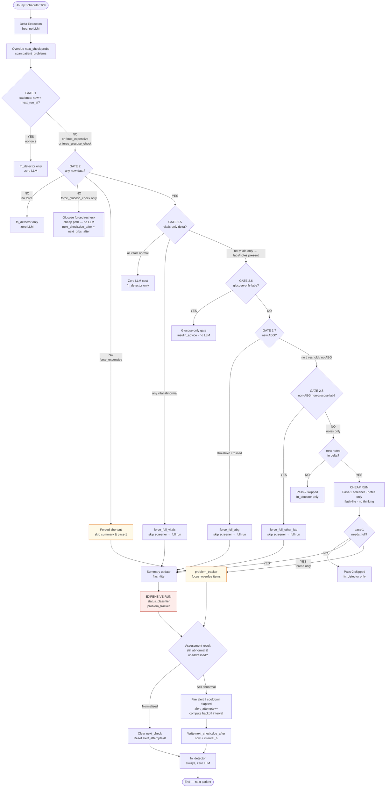

# CDS Pipeline — Per-Patient Decision Flow

This page documents the adaptive scheduling logic introduced to reduce LLM cost and guarantee
per-problem clinical follow-up. The pipeline runs **every hour** (Cloud Scheduler), loops all
admitted patients sequentially, and applies a cascade of gates before reaching any paid LLM call.

---

## Gate sequence



---

## Gate descriptions

### GATE 2.5 — Vital-within-normal gate (bidirectional)

Added in `fn_detector.py` (`is_vital_row_normal`, `all_new_vitals_normal`).

Fires when the delta is **vitals-only** (no new labs, notes, or report findings):

| Condition | Outcome |
|---|---|
| All vitals score 0 on NEWS2 (O2 component stripped) | `vital_normal_gate=skipped` — zero LLM cost for that cycle |
| Any vital is abnormal | `force_full_vitals=True` → skips Pass-1 screener, runs full Pass 2 |

The gate is two-sided: it can skip a run entirely when everything is normal, or force a full run when something is abnormal. When the delta is not vitals-only (labs or notes also present), Gate 2.5 does not fire — the other gates handle the mixed case.

### GATE 2.6 — Glucose-only gate

Fires when: no forced recheck, no new reports, delta is labs-only, and **every** new lab doc is glucose-named (RBS/CBG/GRBS/Blood Glucose/Random Blood Glucose).

Routes directly to `insulin_advice.gather_inputs + compute → alert card`, skipping summary update, Pass 1, status_classifier, and problem_tracker entirely. `next_check.due_after` is set from `next_grbs_after` returned by the insulin engine.

A panel document (e.g. "Renal Function Test") that happens to contain a glucose attribute does **not** trigger Gate 2.6 — it falls through to Gate 2.8 (full run). This is correct: panel results may contain other values that need assessment.

### GATE 2.7 — ABG gate (deterministic threshold check)

Fires when the delta contains any new blood gas panel (ABG/VBG/Gas Panel). Checks five parameters:

| Parameter | Flag threshold |
|---|---|
| pH | < 7.30 or > 7.50 |
| pO2 | < 60 mmHg |
| paCO2 | > 50 mmHg or < 30 mmHg |
| Lactate | > 2 mmol/L |
| Bicarb (HCO3) | < 15 or > 35 mmol/L |

Thresholds are intentionally lax — this is a screening gate. Missing a borderline ABG is more dangerous than running an unnecessary Pass 2.

| Condition | Outcome |
|---|---|
| Any value crosses threshold | `force_full_abg=True` → full analysis |
| ABG present, no threshold crossed | No action; Pass-1 note screener may still fire |

### GATE 2.8 — Non-ABG, non-glucose lab gate

Fires when the delta contains **any** new lab that is neither an ABG panel nor a glucose test (e.g. creatinine, Hb, troponin, electrolytes, WBC). Always triggers a full run — any new lab result is information the problem tracker should assess.

`force_full_other_lab=True` → skips Pass-1 screener, runs full Pass 2.

### GATE 3 / Pass-1 screener — Notes only

The Pass-1 screener (`pass1_screener.py`) runs **only when**:
1. No upstream gate fired a force flag (`force_full_vitals`, `force_full_abg`, `force_full_other_lab`, `force_expensive`)
2. At least one new note is present in the delta

Its sole responsibility is reading free-text clinical note content and deciding if it contains anything significant — a new problem, treatment failure, plan change, or worrying finding. It does **not** re-evaluate vitals or labs; those are handled deterministically by Gates 2.5–2.8.

The note text is passed in full (up to 1000 chars per note, up to 5 notes). The screener returns `needs_full_analysis` + `flag_reason`.

If no new notes are present, the screener is skipped entirely (no LLM call) and Pass 2 is also skipped.

**Design principle:** each gate owns one data type. Vitals → Gate 2.5. Glucose → Gate 2.6. ABG → Gate 2.7. Other labs → Gate 2.8. Free text → Pass-1 screener. No overlap.

### Clinical Timeline

The problem tracker and status classifier now share a **per-patient clinical event timeline** stored at `patient_contexts.clinical_timeline`. This is an incrementally-maintained ordered history of clinical events — the structural fix for temporal reasoning errors (e.g. flagging NPO → oral diet progression as a "contradiction").

#### Storage model

```json
{
  "prior_course": "<compressed prose — settled history, ≤1500 chars>",
  "recent_events": [
    { "t": "2026-06-23T14:00:00Z", "event": "NPO ordered for suspected SBO",
      "problem": "Subacute Intestinal Obstruction", "kind": "order",
      "source": "note@2026-06-23T14:00" },
    { "t": "2026-06-25T09:20:00Z", "event": "Oral nutrition resumed, tolerating liquids",
      "problem": "Subacute Intestinal Obstruction", "kind": "status_change",
      "source": "note@2026-06-25T09:20" }
  ]
}
```

`source` on every event is the anti-hallucination guard — every event must cite a note timestamp, lab name/value, or vital name/value from real data.

#### Windowing and fold-on-eviction

| Parameter | Value |
|---|---|
| `RECENT_DAYS` | 7 days |
| `RECENT_MAX_EVENTS` | 30 events |
| `PRIOR_COURSE_MAX_CHARS` | 1500 chars |

An event stays in `recent_events` while within **both** windows. Evicted events are folded into `prior_course` via an append-only operation. The fold fires at most once per eviction cycle, preserves existing `prior_course` verbatim, and only condenses the oldest prose if the char cap is exceeded.

**No-data-loss:** `recent_events` drops evicted events only when the model returned a non-None `prior_course` for that fold. If the fold didn't happen, events stay and retry next run.

#### Data flow per expensive run

| Step | Action |
|---|---|
| `scheduler.py` | Loads `clinical_timeline` from `ctx` at run start |
| `status_classifier` | Receives timeline (read-only); renders it into the prefetch block for temporal context |
| `problem_tracker` | Receives timeline; renders it + optional fold instruction into user message; emits `timeline_updates` (new events) and conditional `prior_course` via `set_all_assessments` |
| `scheduler.py` | Persists `tracker_result["clinical_timeline"]` back to `patient_contexts` |

**Cost:** zero extra LLM calls. The timeline is emitted as part of the tracker's existing `set_all_assessments` tool call.

#### Implementation files

| File | Role |
|---|---|
| `tools/radar_sync/clinical_timeline.py` | Pure functions: `partition`, `render`, `render_for_tracker`, `apply_updates`, constants |
| `tools/radar_sync/problem_tracker.py` | Consumes + maintains timeline; `set_all_assessments` schema adds `timeline_updates` + `prior_course` |
| `tools/radar_sync/status_classifier.py` | Reads timeline into prefetch block (read-only) |
| `app/backend/scheduler.py` | Loads + persists `clinical_timeline` on `patient_contexts` |
| `dashboard/audit.py` | Exposes `clinical_timeline` in patient detail payload |

### Overdue next_check routing

When `overdue_next_checks()` finds any lab-type `next_check` whose `due_after < now`, the overdue
items are split into two buckets:

| Bucket | Variable | Condition | Effect |
|---|---|---|---|
| **Glucose** | `_overdue_glucose` | key/label matches glucose keywords (glucose, rbs, cbg, grbs, blood sugar …) | Sets `force_glucose_check=True` |
| **Generic** | `_overdue_generic` | everything else (creatinine, Hb, lactate, …) | Sets `force_expensive=True` |

**`force_expensive` (generic)** — bypasses cadence gate, delta gate, and pass-1; runs the full
`track_problems` LLM call with a `FORCED FOLLOW-UP` block naming the overdue item(s).

**`force_glucose_check` (glucose-only)** — bypasses cadence gate and delta gate but skips all LLM
entirely. Routes to the same cheap path as Gate 2.6: `insulin_advice.gather_inputs + compute →
alert card → update next_check.due_after`. No pass-1, no problem_tracker.

If both buckets are non-empty simultaneously (e.g. glucose + creatinine both overdue), only
`force_expensive` is set — the full expensive run handles glucose via the normal
`attach_insulin_order` enrichment path.

---

## Exponential backoff

When a follow-up finds the value **still abnormal and unaddressed** (proxy for caregiver ignoring the alert), `alert_attempts` increments and the next interval grows:

```
interval_h = min(base_interval × 2^attempts, 24h)
```

Growth stops at 4 attempts **or** when the 24h cap is hit, whichever comes first.

| Type | Base | attempt 0 | 1 | 2 | 3 | 4 (stop) |
|---|---|---|---|---|---|---|
| Vital | 1h | 1h | 2h | 4h | 8h | 16h |
| Fast lab (lactate, Na, K, ABG, Hb) | 6h | 6h | 12h | 24h | — | — |
| Other labs | 24h | 24h | — | — | — | — |
| **Glucose (hyperglycemia)** | **insulin timing** | **1h / 4h / 6h** | — | — | — | — |

**Reset conditions:** problem normalises, or a fresh plan note appears (`being_addressed` flips to true) → `alert_attempts = 0`.

**Glucose exception:** `next_check.due_after` for hyperglycemia problems is **not** computed from the backoff table. After `attach_insulin_order` runs (in both the cheap glucose path and the full tracker path), the stored `due_after` is overwritten with `snapshot_at + next_grbs_after`, where `next_grbs_after` comes from the insulin recommendation engine:

| Route | Diet | `next_grbs_after` |
|---|---|---|
| IV insulin | any | 1h (hourly if glucose uncontrolled) or 2h (if all readings 140–180) |
| SC insulin | NPO / fasting | 4h |
| SC insulin | eating | 6h |

---

## IO-change delta triggering

### Why a raw IO entry can't be a trigger by itself

The Radar IO data structure is `chart.io.days[].hours[].minutes[]` — entries are keyed by day/hour/minute index, not by a standalone timestamp. This makes it impossible to apply the same cutoff comparison used for vitals and labs (`timestamp > last_llm_run_at`). It also means a single isolated IO reading (e.g. 5 cc urine in one hour) would be a clinically meaningless trigger — urine output is only interpretable in the context of the past several hours.

### How IO triggering works

`extract_delta` computes `io_last_24h` — a 24-hour aggregate of all intake, output, and balance entries — and compares it to `last_io_aggregate` stored in `snapshot_schedule` after the previous run:

```python
io_changed = bool(prev_io_aggregate) and (io_now != prev_io_aggregate)
```

If the aggregates differ, `io_changed=True` is included in the delta and Gate 2 treats it as new data, allowing the pipeline to proceed. What the LLM then receives is the **full 24h aggregate** (`I/O: intake=X ml  output=Y ml  balance=Z ml`), not the raw individual entry. This means the model always assesses IO in the context of cumulative fluid balance rather than a single measurement.

### Seeding and bootstrap

On the first run for a newly enrolled patient, `last_io_aggregate` is `None` in the schedule doc. `io_changed` defaults to `False` in this case — IO alone will not trigger a run until a baseline aggregate has been stored. Once any real LLM run completes (triggered by a vital, lab, note, or overdue next_check), `last_io_aggregate` is written to the schedule doc and future IO changes will be detected normally.

### What triggers `last_io_aggregate` to update

It is stored alongside `last_llm_run_at` at every point the pipeline completes a real LLM analysis: pass1 completion, glucose-only gate, and forced-by-overdue-next_check runs. It is **not** updated on delta-gate skips, vital-normal skips, or empty-chart skips — those runs did not process the IO data, so the stored baseline should not advance.

---

## Re-alert suppression (cooldown)

The backoff interval doubles as the re-alert cooldown window — there is **no separate 8-hour cooldown**. When an alert fires, `_upsert_problem` stores `current_interval_h` on the problem doc and sets `next_check.due_after = now + interval_h`. `_should_suppress_alert` reads `current_interval_h` from the stored doc to decide whether to suppress the next alert attempt for the same problem.

### Concrete example — SpO2 / hypoxemia

| Alert # | `alert_attempts` before fire | Cooldown stored | Earliest next alert |
|---|---|---|---|
| 1st | 0 | 1h | 1h after 1st alert |
| 2nd | 1 | 2h | 2h after 2nd alert |
| 3rd | 2 | 4h | 4h after 3rd alert |
| 4th | 3 | 8h | 8h after 4th alert |
| 5th+ | 4 | 16h (cap) | 16h after each subsequent alert |

This means a vital problem that keeps alerting without a plan will see its re-alert window grow: 1h → 2h → 4h → 8h → 16h. The old hardcoded 8h value (`_ALERT_COOLDOWN_H = 8`) is retained **only as a legacy fallback** for problem docs written before the backoff system existed (docs that have no `current_interval_h` field). Any problem doc written by the current code will have `current_interval_h` set and will never reach the 8h fallback.

### Suppression check
`_should_suppress_alert` in `problem_tracker.py`:
```python
cooldown_h = doc.get("current_interval_h") or _ALERT_COOLDOWN_H   # 8h fallback for legacy docs only
return (datetime.now(timezone.utc) - last) < timedelta(hours=cooldown_h)
```

The suppression fires **before** the model runs — a suppressed problem is never sent to the tracker LLM for that cycle.

---

## Key files

| File | Role |
|---|---|
| `app/backend/scheduler.py` | Gate sequence, `_run_live_pipeline()`, `_is_abg_lab()`, `_check_abg_thresholds()` |
| `tools/radar_sync/fn_detector.py` | `is_vital_row_normal`, `all_new_vitals_normal`, NEWS2 scoring |
| `tools/radar_sync/problem_tracker.py` | `overdue_next_checks`, `track_problems(focus=...)`, backoff in `_upsert_problem` |
| `tools/radar_sync/pass1_screener.py` | Note-only screener; `needs_full_analysis`, `flag_reason` |
| `tools/radar_sync/status_classifier.py` | Reasoning-model status labels (skipped on forced-only path); reads clinical_timeline |
| `tools/radar_sync/clinical_timeline.py` | Two-zone timeline: `partition`, `render`, `render_for_tracker`, `apply_updates` |
