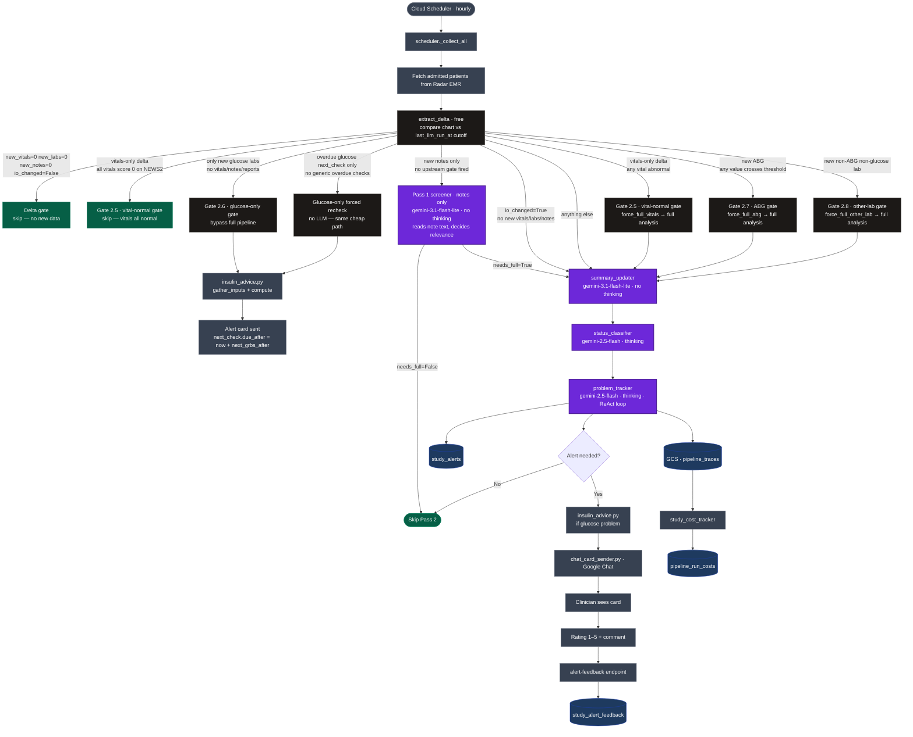
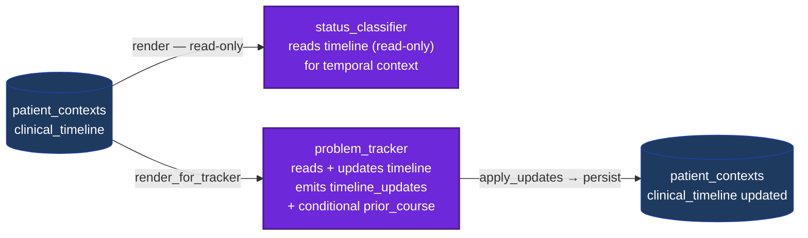
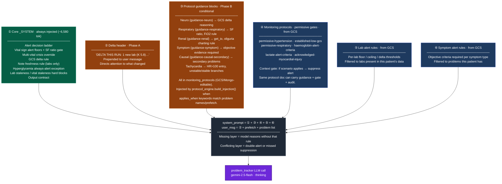
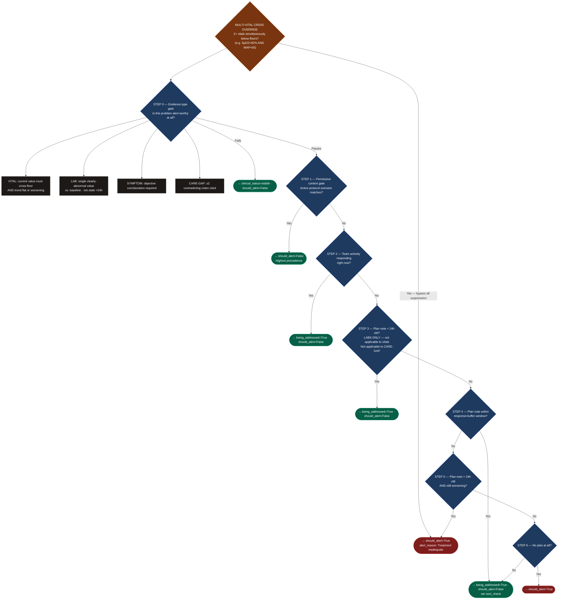
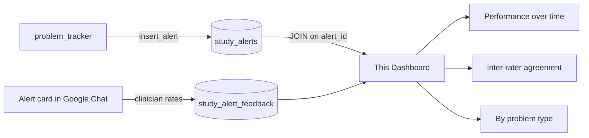

# Hourly Pipeline Overview

The CDS pipeline runs once per hour via Cloud Scheduler. It screens all admitted patients in the monitored workspaces, tracks clinical problems, generates alert cards, and sends them to clinicians via Google Chat for rating.

## End-to-End Flow

LLM nodes are highlighted in purple — these are the points where model errors, prompt issues, or attention failures can affect patient safety. Cost-free gates are in grey; they short-circuit the pipeline before any LLM call.



## Delta Extraction

At the start of every patient run, `delta_extractor.extract_delta()` compares the current chart snapshot against the `last_llm_run_at` cutoff timestamp stored in `snapshot_schedule`.

```
new_vitals          — vital readings with timestamp > cutoff
new_labs            — lab documents with reportedAt > cutoff
new_notes           — note content entries with timestamp > cutoff
delta_orders        — always the full current active/pending orders (no diff possible)
io_last_24h         — full 24h I/O aggregate (intake_ml, output_ml, balance_ml)
io_changed          — True when io_last_24h differs from the value stored at last run
new_report_findings — injected later by analyze_new_reports (Phase 2)
```

`io_changed` is computed by comparing the current 24h aggregate against `last_io_aggregate` stored in `snapshot_schedule` after the previous run. The raw IO structure (`chart.io.days[].hours[].minutes[]`) has no per-entry timestamps; the aggregate comparison is the only reliable way to detect a new entry. When `io_changed=True`, the **full 24h aggregate** is what the LLM sees — never a single isolated IO reading.

### First-run seeding behaviour

On the very first run for a newly enrolled patient, there is no `last_llm_run_at` cutoff (`cutoff: none` in the log). Rather than returning the entire chart history, the extractor returns a **shallow seed**:

| Field | First-run behaviour |
|---|---|
| `new_vitals` | Newest **6** readings only (`vitals[:6]`, array is newest-first) |
| `new_labs` | Newest **10** lab documents (`docs[-10:]`, array is oldest-first) |
| `new_notes` | Last **3 substantive** notes (>100 chars; falls back to last 3 if none qualify) |
| `new_report_findings` | Empty — populated later if reports are processed |

This means patients enrolled with a long ICU history will have a narrow delta on their first run. The rolling summary updater fills in the broader clinical picture, but the delta itself is always shallow at enrollment.

**Implication:** patients whose Radar chart has no vitals, no labs, and no qualifying notes at enrollment will show `{new_vitals: 0, new_labs: 0, new_notes: 0}` and be skipped by the delta gate on that first run. This is expected — they will process normally on the next run once clinical data is recorded.

### Delta-scope scoping (Phases A/B/C)

After extraction, `delta_scope.classify_delta()` analyses the delta to derive a **blast radius** — the set of problems and rules this delta could plausibly move.

| Delta content | `is_wildcard` | Phase B rule-block scoping | Phase C problem pruning |
|---|---|---|---|
| New notes or report findings | **Yes** | All blocks injected | All problems assessed |
| Non-ABG, non-glucose labs | No | Only blocks for matched categories | Only blast-radius problems |
| ABG labs | No | Respiratory block injected | Only respiratory/acid-base problems |
| Vitals only (abnormal) | No | Only vital-driven blocks | Only vital-driven problems |
| IO only | No | Renal block only | Only renal/fluid problems |
| Glucose labs only | No | **Bypassed** (Gate 2.6 fires first) | **Bypassed** |
| No new data | No | No expensive run (delta gate fires) | — |

**Safety invariant:** any delta containing `new_notes` or `new_report_findings` is a wildcard — unstructured text can introduce new problems, plan changes, or care-gaps that keyword matching cannot anticipate. Wildcard deltas always produce a full pipeline run with no scoping.

**Phase C (problem pruning)** is **active** (`DELTA_SCOPE_PRUNE=1` set in production). The problem_tracker only receives the blast-radius set; `would_prune` problems are excluded from the LLM call entirely. This reduces token cost for single-vital or single-lab runs where unrelated problems have no new data to re-assess.

## Bypass Gates (zero LLM cost)

| Gate | Condition | Outcome |
|---|---|---|
| **Delta gate** | `new_vitals=0 AND new_labs=0 AND new_notes=0 AND io_changed=False` (and no overdue checks) | Skip entire LLM pipeline; update `next_run_at` |
| **Gate 2.5 · vital-normal (skip)** | Delta is vitals-only AND all new vitals score 0 on NEWS2 | Skip LLM; schedule next run in 1h |
| **Gate 2.5 · vital-abnormal (force)** | Delta is vitals-only AND any vital is abnormal | `force_full_vitals` → bypass screener, run full Pass 2 |
| **Gate 2.6 · glucose-only** | Delta is labs-only AND all new lab docs are glucose-named (RBS/CBG/GRBS/Blood Glucose) | Skip Pass 1 + Pass 2; call `insulin_advice` directly; send alert card |
| **Gate 2.7 · ABG threshold** | New ABG lab AND any of pH/pO2/paCO2/lactate/bicarb crosses threshold | `force_full_abg` → bypass screener, run full Pass 2 |
| **Gate 2.7 · ABG no threshold** | New ABG lab AND no value crosses threshold | No action; notes screener may still fire if new notes also present |
| **Gate 2.8 · other lab** | Any new lab that is neither ABG nor glucose | `force_full_other_lab` → bypass screener, run full Pass 2 |
| **Pass-1 screener skip (no notes)** | No upstream gate fired AND no new notes in delta | Skip screener and Pass 2; update schedule |
| **Glucose-only forced recheck** | Overdue `next_check` is glucose only (no other overdue generic labs) | Same cheap path as Gate 2.6 — no LLM; `next_check.due_after` set from `next_grbs_after` |
| **Generic forced recheck** | Overdue `next_check` is a non-glucose lab (creatinine, Hb, etc.) | Bypass cadence + delta + screener; run full `track_problems` with `focus=overdue items` |

Gate 2.6 fires only when the incoming lab document is **named** as a standalone glucose test. A panel document (e.g. "Renal Function Test") that happens to contain a glucose attribute does not trigger it — it falls through to Gate 2.8, which triggers a full run.

**ABG thresholds (Gate 2.7):**

| Parameter | Flag threshold |
|---|---|
| pH | < 7.30 or > 7.50 |
| pO2 | < 60 mmHg |
| paCO2 | > 50 mmHg or < 30 mmHg |
| Lactate | > 2 mmol/L |
| Bicarb (HCO3) | < 15 or > 35 mmol/L |

Thresholds are intentionally lax — this is a screening gate and false negatives (missing a borderline ABG) are more dangerous than false positives (running an unnecessary Pass 2).

## Pass-1 Screener — Notes Only

The Pass-1 screener (`pass1_screener.py`) is called **only when** all of the following are true:
- No upstream gate fired a force flag (`force_full_vitals`, `force_full_abg`, `force_full_other_lab`, `force_expensive`)
- At least one new note is present in the delta

Its sole job is to read the note text and decide if there is anything clinically significant — a new problem, treatment failure, plan change, or worrying finding described by the treating team. It does not re-evaluate vitals or labs (those are handled deterministically by Gates 2.5–2.8).

| Screener outcome | Action |
|---|---|
| `needs_full_analysis=true` | Run summary_updater → status_classifier → problem_tracker |
| `needs_full_analysis=false` | Skip Pass 2; update schedule; run fn_detector |
| Screener fails / exception | Default to `needs_full_analysis=false` (safe — avoids burning expensive model on an uncertain call) |

Each gate has a distinct responsibility — vitals to Gate 2.5, ABG to Gate 2.7, other labs to Gate 2.8, free text to the screener. No overlap.

## Clinical Timeline

The problem tracker maintains a **per-patient clinical event timeline** stored in `patient_contexts.clinical_timeline`. It is an ordered record of what happened and when — complementary to `structured_summary` ("what is true now") and designed to prevent temporal-reasoning errors like flagging clinical progression as a contradiction.

### Two-zone model

| Zone | Field | Description |
|---|---|---|
| **Recent events** | `recent_events[]` | Full-fidelity structured list, never compressed. The model reads this directly to establish temporal order. |
| **Prior course** | `prior_course` | Short prose (≤1500 chars) holding everything that has aged out of the recent window. Appended incrementally — oldest portions condensed only if the cap is exceeded. |

Each event carries:
```json
{ "t": "2026-06-25T09:20:00Z", "event": "Oral nutrition resumed, tolerating liquids",
  "problem": "Subacute Intestinal Obstruction", "kind": "status_change",
  "source": "note@2026-06-25T09:20" }
```
`source` is mandatory — it anchors every event to real data and prevents hallucination.

### Windowing (fold-on-eviction)

An event stays in `recent_events` while **both** hold: within the last **7 days** AND within the last **30 events**. Failing either evicts it into `prior_course`. The fold is **append-only and rare** — it only fires when something actually ages out, and it preserves the existing `prior_course` text verbatim before appending new clauses.

**No-data-loss guarantee:** events are dropped from `recent_events` only when the model successfully emitted an updated `prior_course`. If the fold failed, the events remain and retry next run.

### How it flows



The timeline is **read by both** `status_classifier` and `problem_tracker`, but **only maintained by** the tracker. It is emitted as part of the existing `set_all_assessments` tool call — no extra LLM call, no added cost.

### Why this fixes temporal reasoning errors

Previously the tracker reasoned over a flat, unordered bag of notes. Seeing an old NPO note and a new "tolerating oral" note together triggered a "contradiction" alert. With the timeline, the temporal ordering is explicit: the model sees the progression and treats it as clinical advancement, not a care-gap.

The CARE-GAP criterion now applies **only** when two notes from the same care period describe incompatible active orders, or the most recent note itself documents an unresolved conflict.

## Problem Tracker Prompt Assembly

Before each LLM call, the pipeline assembles the system prompt in layers. Each layer is a potential failure point — a missing block means the model reasons without that rule; a conflicting block causes double-alerting or missed suppression.



## Alert Decision Ladder

For each problem, the model walks this ladder top-to-bottom. The **first matching step wins** — lower steps are never reached once a match fires.



**Exceptions always in effect:**
- **Hyperglycemia** — Steps 3 and 4 are skipped; always `should_alert=True` when glucose is above threshold regardless of plan notes.
- **SF ratio persistence override** — SF ratio gate is bypassed if SpO2 < 92% in ≥2 consecutive readings.

**Global constraint:** never alert when `clinical_status` is stable, improving, or resolved — even if a `next_check` is overdue.

## Feedback Loop



## Key Tables

| Table | Purpose |
|---|---|
| `cds_study.study_alerts` | One row per alert generated |
| `cds_study.study_alert_feedback` | One row per clinician rating |
| `cds_study.pipeline_run_costs` | LLM token cost per hourly run |
| `cds_study.study_suppressed_events` | Alerts suppressed (not sent) |
| `cds_study.report_interpret_runs` | Cost and count per report interpretation cycle |

All tables are in project `patientview-9uxml`, dataset `cds_study`, region `asia-south1`.
