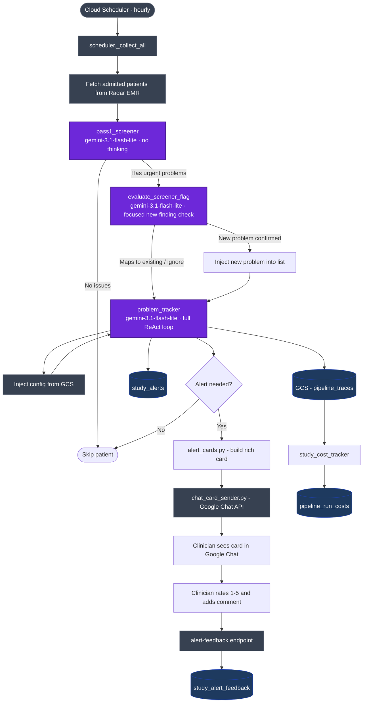
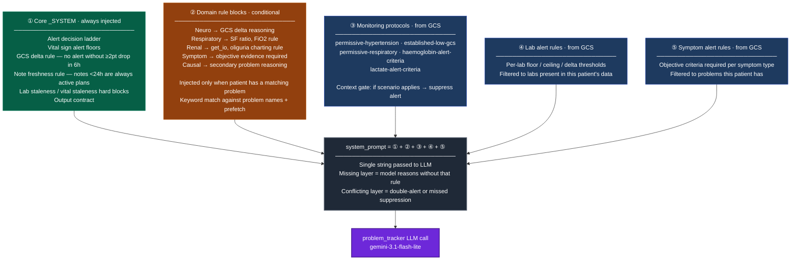
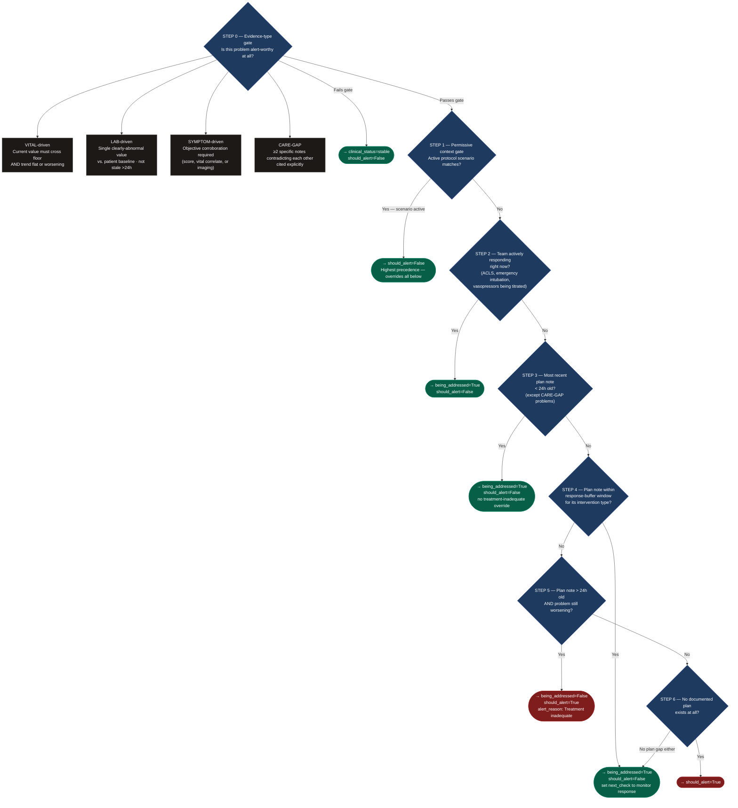
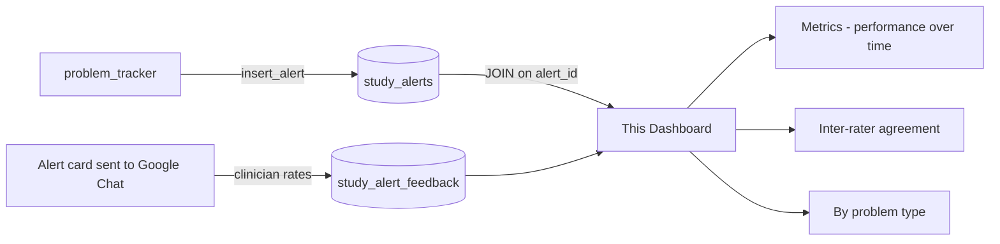

# Hourly Pipeline Overview

The CDS pipeline runs once per hour via Cloud Scheduler. It screens all admitted patients in the monitored workspaces, tracks clinical problems, generates alert cards, and sends them to clinicians via Google Chat for rating.

## End-to-End Flow

LLM nodes are highlighted in purple — these are the points where model errors, prompt issues, or attention failures can affect patient safety.

## Problem Tracker Prompt Assembly

Before each LLM call, the pipeline assembles the system prompt in layers. Each layer is a potential failure point — a missing block means the model reasons without that rule; a conflicting block causes double-alerting or missed suppression.

## Alert Decision Ladder

For each problem, the model walks this ladder top-to-bottom. The **first matching step wins** — lower steps are never reached once a match fires. This is the core logic inside the `problem_tracker` LLM call.

**Global constraint (applies at every step):** Never alert when `clinical_status` is stable, improving, or resolved — even if a `next_check` is overdue.

## Feedback Loop

Clinician ratings flow back into BigQuery and surface in this dashboard:

## Key Tables

| Table | Purpose |
|---|---|
| `cds_study.study_alerts` | One row per alert generated |
| `cds_study.study_alert_feedback` | One row per clinician rating |
| `cds_study.pipeline_run_costs` | LLM token cost per hourly run |
| `cds_study.study_suppressed_events` | Alerts that were suppressed (not sent) |

All tables are in project `patientview-9uxml`, dataset `cds_study`, region `asia-south1`.
