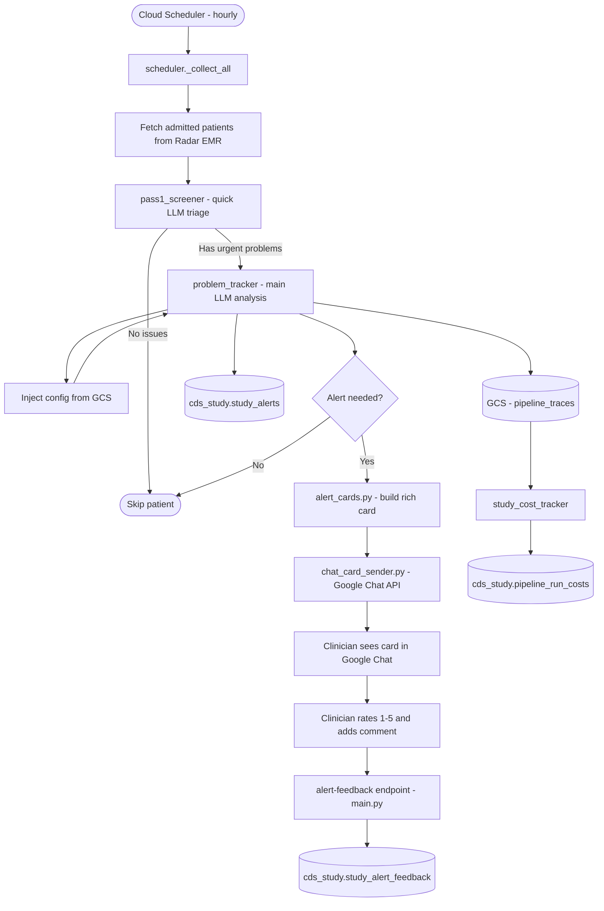
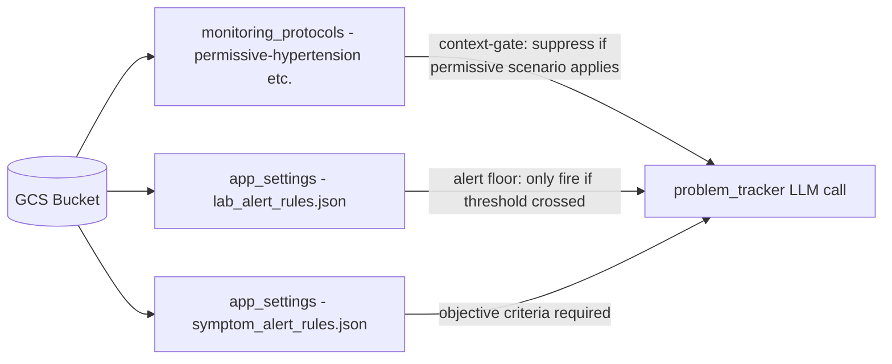
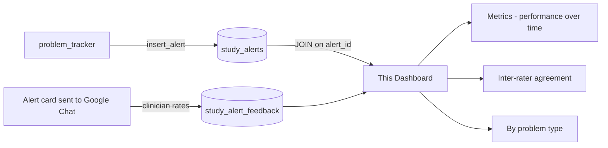

# Hourly Pipeline Overview

The CDS pipeline runs once per hour via Cloud Scheduler. It screens all admitted patients in the monitored workspaces, tracks clinical problems, generates alert cards, and sends them to clinicians via Google Chat for rating.

## End-to-End Flow

## Config Injection

Before the LLM analyses each patient, the pipeline injects relevant config from GCS into the system prompt:

## Feedback Loop

Clinician ratings flow back into BigQuery and surface in this dashboard:

## Key Tables

| Table | Purpose |
|---|---|
| `cds_study.study_alerts` | One row per alert generated |
| `cds_study.study_alert_feedback` | One row per clinician rating |
| `cds_study.pipeline_run_costs` | LLM token cost per hourly run |
| `cds_study.study_suppressed_events` | Alerts that were suppressed (not sent) |

All tables are in project `patientview-9uxml`, dataset `cds_study`, region `asia-south1`.
